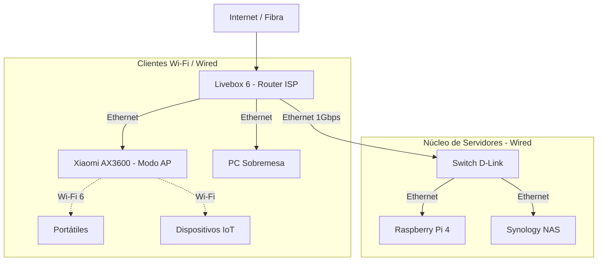

[🏠 Inicio](../README.md) > [📂 Infraestructura](_index.md)

# Arquitectura de Red Física

Este documento describe la topología de red actual y las recomendaciones para conectar los servidores (Raspberry Pi y NAS) para garantizar el máximo rendimiento y estabilidad.

## Inventario de Red (Hardware)

Basado en el hardware disponible:
- **Router ISP**: Livebox 6 (Orange) - Fibra.
- **Router Neutro**: Xiaomi Mi AIoT Router AX3600.
- **Switch**: D-Link 4 puertos (Unmanaged).
- **Servidores**: Raspberry Pi 4, Synology NAS DS110j.

## Topología Recomendada

Para un entorno de laboratorio ("Homelab") estable, la regla de oro es: **Servidores siempre por cable**.

### Consideraciones de Diseño

1.  **Cuello de Botella**: Todo el tráfico entre la Raspberry Pi y el NAS pasará por el Switch. Asegúrate de que el cableado sea **Cat 5e o superior** para garantizar 1 Gbps real.
2.  **Wi-Fi**: Se recomienda delegar el Wi-Fi al Xiaomi AX3600 por su mejor rendimiento, configurándolo en modo "Punto de Acceso" (AP) para evitar doble NAT, o dejando el Livebox solo como módem (si permite modo bridge) y que el Xiaomi gestione toda la red.
3.  **IPs Estáticas**:
    *   Es fundamental asignar IPs estáticas (vía DHCP Reservation en el router) a la Raspberry Pi y al NAS.
    *   Ejemplo: `192.168.1.10` (Pi), `192.168.1.11` (NAS).

## Segmentación (Futuro)

Actualmente la red es plana (todos se ven con todos). En el futuro, si expones servicios a internet, podrías considerar:
- **VLANs**: Separar dispositivos IoT inseguros de los servidores.
- **DMZ**: Aislar servicios expuestos (como el servidor web) del resto de la red doméstica.
