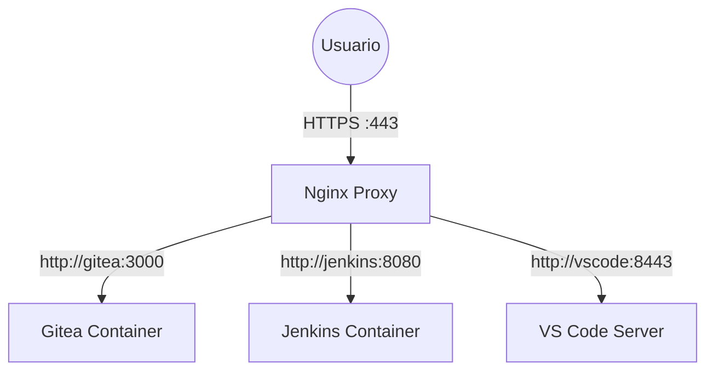

[🏠 Inicio](../README.md) > [📂 Infraestructura](_index.md)

# Configuración de Proxy Inverso con Nginx

El Proxy Inverso es la pieza fundamental para exponer múltiples servicios (Gitea, Jenkins, VS Code) a través de un único punto de entrada (puertos 80/443), gestionando dominios y certificados SSL de forma centralizada.

## ¿Por qué Nginx?

- **Centralización**: Un solo lugar para configurar SSL (HTTPS) y seguridad.
- **Limpieza**: Evita tener que abrir puertos extraños (3000, 8080, etc.) en el router.
- **Dominios**: Permite usar subdominios (`git.home.lab`, `jenkins.home.lab`) en lugar de IPs y puertos.

## Arquitectura Propuesta

Todos los servicios web correrán en contenedores Docker. Nginx también correrá en Docker y será el único contenedor con puertos expuestos al host (y por tanto, a la red).



## Implementación con Docker Compose

Crearemos una estructura de carpetas para organizar la configuración de Nginx.

### 1. Estructura de Directorios

Usaremos el disco USB montado en `/mnt/usb-data`. Para ficheros que necesiten edición (certificados, configs) prefiero bind mounts absolutos; para datos internos deja que Docker gestione `named volumes`.

```bash
# Crear directorios para bind-mounts (configs, certs, logs)
sudo mkdir -p /mnt/usb-data/nginx/conf.d
sudo mkdir -p /mnt/usb-data/nginx/certs
sudo mkdir -p /mnt/usb-data/nginx/logs
sudo chown -R root:root /mnt/usb-data/nginx
sudo chmod 750 /mnt/usb-data/nginx/certs
```

### 2. Archivo `docker-compose.yml`

Ubicación recomendada: `/mnt/usb-data/nginx/docker-compose.yml` 

Ejemplo con bind mounts absolutos (configs/certs en el USB, control total sobre las rutas):

```yaml
version: '3.8'

services:
  nginx:
    image: nginx:latest
    container_name: nginx_proxy
    restart: unless-stopped
    ports:
      - "80:80"
      - "443:443"
    volumes:
      - /mnt/usb-data/nginx/conf.d:/etc/nginx/conf.d:ro
      - /mnt/usb-data/nginx/certs:/etc/nginx/certs:ro
      - /mnt/usb-data/nginx/logs:/var/log/nginx
    networks:
      - proxy_net

networks:
  proxy_net:
    name: proxy_net
    driver: bridge
```

Ejemplo alternativo usando bind‑mounts absolutos para todos los volúmenes (montaje directo desde el host):

`

> **Nota**: La red `proxy_net` es crucial. Todos los futuros servicios (Gitea, Jenkins) deberán conectarse a esta red externa para que Nginx pueda verlos.

**Recomendación**: Cuando necesites editar ficheros desde el host (configs, certificados, logs) usa bind‑mounts absolutos en la forma `/host/path:/container/path[:ro]`. Esto hace que los cambios en el host se reflejen inmediatamente en el contenedor. Para datos que no necesites tocar directamente desde el host (bases de datos, datos internos) podrías considerar `named volumes`, pero en esta documentación priorizaremos bind‑mounts para mayor transparencia.

### 3. Configuración Base (`default.conf`)

Ubicación: `/mnt/usb-data/nginx/conf.d/default.conf`

Esta configuración redirige todo el tráfico HTTP a HTTPS (cuando tengamos certificados) y define una página por defecto.

```nginx
server {
    listen 80;
    server_name _;

    # Redirigir todo a HTTPS (Descomentar cuando se tenga SSL)
    # return 301 https://$host$request_uri;

    location / {
        root   /usr/share/nginx/html;
        index  index.html index.htm;
    }
}
```

## Preparación para Futuros Servicios

Cuando despleguemos un nuevo servicio (ej. Gitea), seguiremos este flujo:

1.  **Docker del Servicio**: Añadirlo a la red `proxy_net`. No exponer puertos al host (usar `expose` o nada, ya que Nginx contacta por red interna).
2.  **Config Nginx**: Crear un archivo `gitea.conf` en `conf.d`.

Ejemplo de `gitea.conf` (Futuro):

```nginx
server {
    listen 80;
    server_name git.home.lab;

    location / {
        proxy_pass http://gitea:3000; # 'gitea' es el nombre del servicio en docker-compose
        proxy_set_header Host $host;
        proxy_set_header X-Real-IP $remote_addr;
        proxy_set_header X-Forwarded-For $proxy_add_x_forwarded_for;
        proxy_set_header X-Forwarded-Proto $scheme;
    }
}
```

### Recargar tras un cambio de configuración

Después de añadir o modificar archivos en `conf.d`, recarga Nginx:

```bash
docker exec nginx_proxy nginx -t # Verificar configuración
docker exec nginx_proxy nginx -s reload # Recargar Nginx
```

## Cambios en la configuración general

### Gitea

Está dando problema con el límite de body size, así que le añadimos

```nginx
client_max_body_size 100m;
```
en el bloque server.
## Homepage

DNS Local (Pi-hole o `/etc/hosts`)

Para que `git.home.lab` funcione dentro de tu red, necesitarás apuntar esos dominios a la IP de tu Raspberry Pi.
- **Opción A (Recomendada)**: Usar Pi-hole o [AdGuard](../general/adguard-home.md) Home como servidor DNS local.
- **Opción B (Manual)**: Editar el archivo `hosts` en cada PC cliente.
